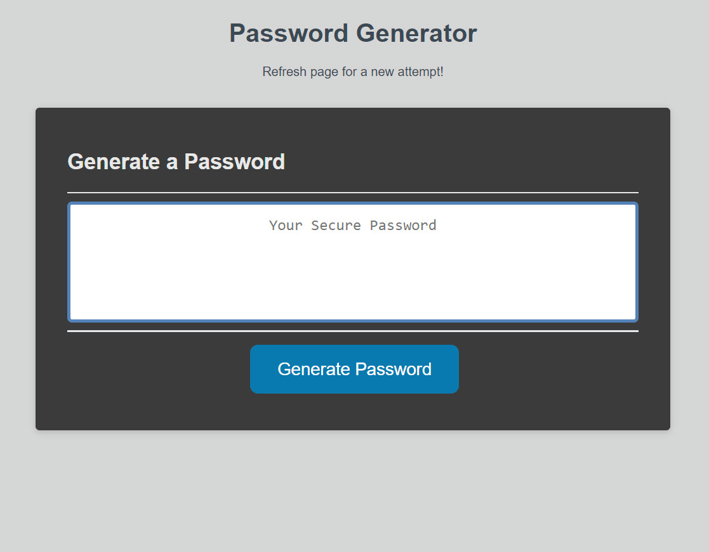

# BootCamp-Homework-Week3

Title: Passord Generator
Author: Bobby Schwartz
Description: This is my Coding Bootcamp Week 3 assignment: a Javascript-based password generator.
created: 1/6/21

## Details:
This program works mostly via javascript.
input options are prompted into a password array that is randomly generated. 
this is then displayed in the center text field.
If an improper password length is entered, an alert will notify the user to input proper values.

## github page: https://robertschwartz603.github.io/BootCamp-Homework-Week3/

